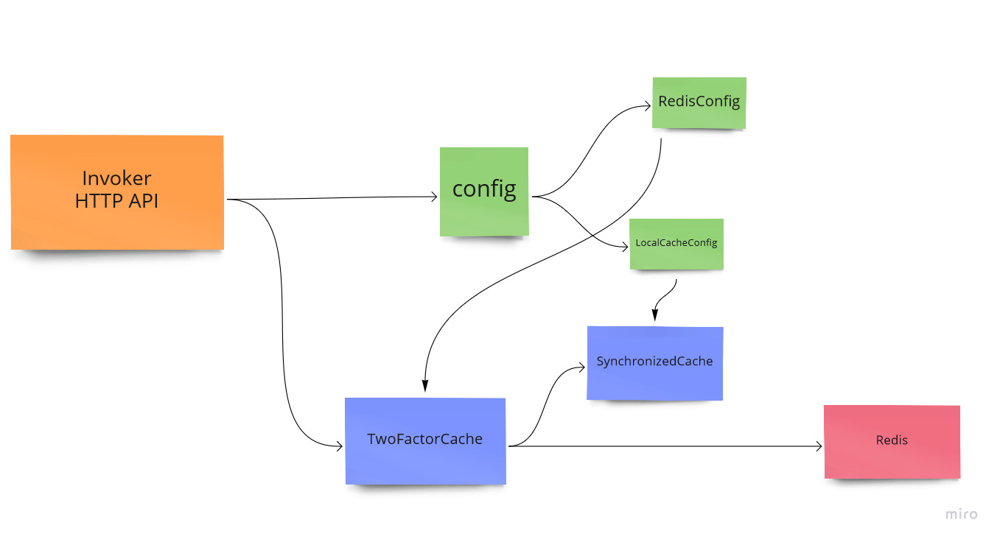
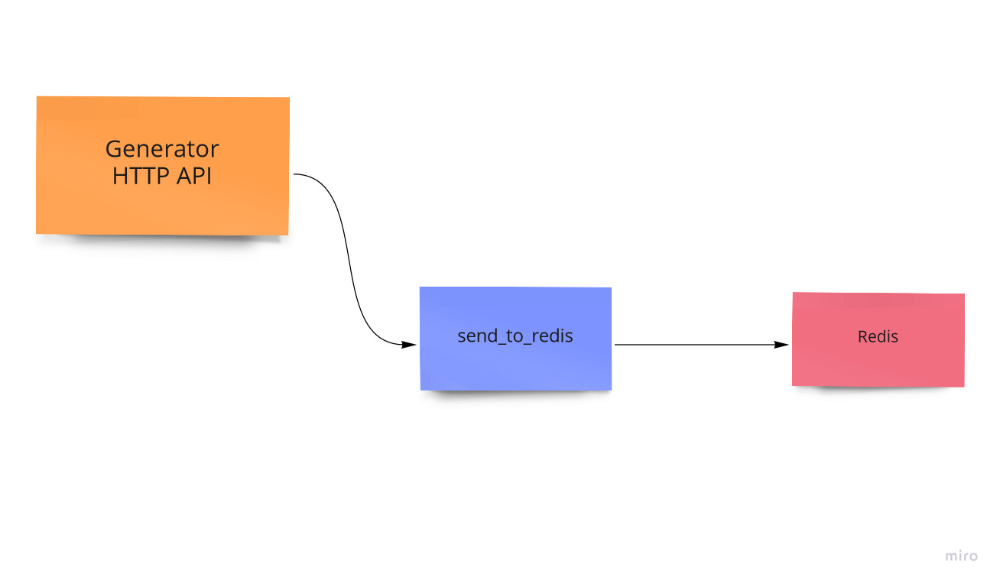
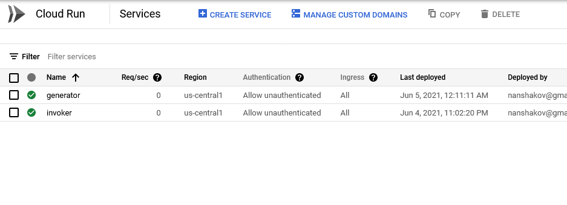
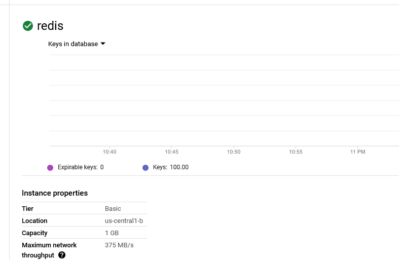

# Задача
Взять список уникальных идентификаторов пользователей (100 шт хватит);

Написать на Flask 2 сервиса

a) сервис (GENERATOR) запускается каждую секунду, генерит рандомное число для каждого ID юзера и записывает информацию в Редис, например: {"user123456": SOMERANDOM_INT};

b) Второй сервис (INVOKER):

    i) Имеет метод getinfo, который по конкретному юзеру выдает из Редиса реверсивное значение SOMERANDOM_INT;
    
    ii) Необходим локальный кэшинг этого значение на 5 секунд. Если по данному юзеру нет данных в локальном кэшинге - брать кэш из редиса. Кэш хранится в отдельном ключе;
    Все сервисы задеплоить на Cloud Run;
    Развернуть на Compute Engine / Memorystore базу данных Redis и сделать коннект между API и Redis;
    В каждом API сделать один метод GET “/ping”, который выдаёт ответ {“pong”}

# Архитектура
## Invoker

## Generator

## файлы
| Файл        | Описание        |
| ------------- |:-------------:|
| invoker/Invoker.py      | Invoker - реализуующий доступ к кешу |
| generator/Generator.py      | Generator - генератор данных в редис      |
| generator/GenerateUsers.py | Скрипт генерации users.txt      |
| generator/users.txt | список из 100 пользователей      |
| .../Dockerfile | Контейнеризация      |
| .../.env | Переменные      |

## Локальный synchronized cache
Для оптимального удаления истекщих ключей взяли OrderedDict, 
т.к. K истекщих ключей всегда будут занимать K первых позиций. Удаляем за O(K)  

# Запуск
### Билд
```gcloud builds submit --tag gcr.io/PROJECT-ID/Invoker```

```gcloud builds submit --tag gcr.io/PROJECT-ID/Generator```
### Деплой
Задеплоили на Cloud Run:

- Invoker https://invoker-wrfgripqtq-uc.a.run.app
- Generator https://generator-wrfgripqtq-uc.a.run.app

подняли Redis и создали Serverless VPC access:

## Примеры команд
### Generator
| Команда        | Результат        |
| ------------- |:-------------:|
| ```curl https://generator-wrfgripqtq-uc.a.run.app/ping```     | ```{pong}``` |
  
### Invoker
| Команда        | Результат        |
| ------------- |:-------------:|
| ```curl https://generator-wrfgripqtq-uc.a.run.app/ping```     | ```{pong}``` |
| ```curl https://invoker-wrfgripqtq-uc.a.run.app/getinfo?userId=1```     | ```{"error":"404 Not Found: Resource not found"}``` |
| ```curl https://invoker-wrfgripqtq-uc.a.run.app/getinfo?userId=user936226```     | ```133``` |